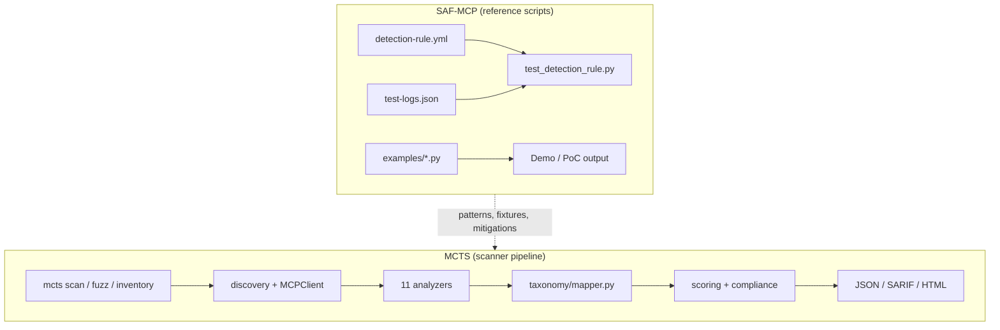

# Script-to-Script Comparison: SAF-MCP vs MCTS

**Sources analyzed**

| Project | Path | Role |
|---------|------|------|
| **SAF-MCP** | `/Users/arghyadeep_nfal/CODE_ARGS/mcp_audit_competitor/saf-mcp-main` | OpenSSF threat-intelligence framework (markdown TTPs + reference detection artifacts) |
| **MCTS** | `/Users/arghyadeep_nfal/CODE_ARGS/contributions/MCTS` | Model Context Threat Scanner — executable CLI audit pipeline |

This document compares **executable Python** in both trees: MCTS analyzers, fuzz/probe/discovery modules, and CLI vs SAF-MCP `test_detection_rule.py` harnesses, `examples/` PoCs, and mitigation reference code. It is written for MCTS maintainers deciding what to adopt, port, or cross-reference.

---

## 1. Executive Summary

SAF-MCP and MCTS solve **different problems** with **different script shapes**:

| | SAF-MCP scripts | MCTS scripts |
|---|-----------------|--------------|
| **Count** | 44 Python files (~9.5k LOC), 72 Sigma YAML, 78 technique READMEs | ~60 Python modules under `src/mcts/` (~5.5k LOC in core scan path) |
| **Purpose** | Validate Sigma rules, demonstrate attacks/defenses, teach detection patterns | Discover MCP servers, statically analyze source/metadata, optionally live-probe, score, report |
| **Input** | NDJSON log fixtures (`test-logs.json`), sample tool JSON, synthetic conversations | Repo paths, MCP configs, live stdio servers |
| **Output** | Pass/fail test summaries, demo prints | `Finding` objects → JSON / SARIF / HTML dashboard |
| **Runtime** | None required (offline scripts) | Full CLI with discovery, consent gates, CI exit codes |

**Overlap is conceptual, not architectural.** The closest apples-to-apples comparison is:

```
SAF-T1001/examples/tpa-detector.py  ↔  MCTS prompt_injection.py + metadata_integrity.py + schema_surface.py
SAF-T1105/test_detection_rule.py    ↔  MCTS path_validation.py + tool_abuse.py (+ fuzz payloads)
SAF-M-63/embedding_sanitization.py  ↔  MCTS data_leakage.py (regex-only today)
```

MCTS currently maps findings to **34+ internal `MCTS-T-*` IDs** in `src/mcts/taxonomy/techniques.json`. SAF-MCP documents **85 `SAF-T-*` techniques** across 14 MITRE-aligned tactics. MCTS operationalizes roughly **45% of the SAF technique catalog** via the parity harness (34 techniques, ≥80% gate in CI); the rest is roadmap surface informed by SAF dossiers and Sigma patterns.

---

## 2. Repository Script Inventory

### 2.1 SAF-MCP Python layout

```
saf-mcp-main/
├── techniques/SAF-TXXXX/
│   ├── detection-rule.yml          # 72 techniques — Sigma reference rules
│   ├── test-logs.json              # 38 techniques — NDJSON fixtures
│   ├── test_detection_rule.py      # 33 techniques — Sigma ↔ fixture validator
│   └── examples/*.py               #  6 techniques — standalone PoC detectors/demos
└── mitigations/SAF-M-63/
    └── embedding_sanitization.py   #  1 mitigation — vector/credential sanitization
```

**SAF-MCP Python by category**

| Category | Files | Lines (approx.) | Function |
|----------|-------|-----------------|----------|
| `test_detection_rule.py` | 33 | ~7,200 | Load Sigma YAML, match NDJSON logs, assert expected detections |
| `examples/` PoCs | 10 | ~3,500 | Standalone detectors (TPA, behavioral, embeddings, vector poisoning, model poisoning) |
| Mitigation reference | 1 | 360 | Credential/embedding sanitization for vector stores |
| **Total** | **44** | **~9,500** | Reference / educational — not a unified scanner |

Techniques **with** `examples/` Python (the highest-fidelity script peers for MCTS):

| Technique | Script(s) | Detection paradigm |
|-----------|-----------|-------------------|
| SAF-T1001 TPA | `tpa-detector.py` | Static metadata scan (description + recursive schema) |
| SAF-T1505 In-Memory Secret Extraction | `detection_embeddings.py`, `detection_clustering.py` | Semantic similarity / clustering |
| SAF-T1603 System Prompt Disclosure | `detection_behavioral.py`, `detection_guard_model.py` | Multi-turn conversation analysis |
| SAF-T2106 Context Memory Poisoning | `vector-store-poisoning-demo.py`, `working-demo.py` | Vector DB contamination demo |
| SAF-T2107 AI Model Poisoning | `training-data-poisoning-demo.py`, `defense-mechanisms-demo.py`, `working-demo.py` | Training-data backdoor demo |

All other SAF techniques ship Sigma + optional test harness only — **no runnable static analyzer** equivalent to MCTS.

### 2.2 MCTS Python layout (scan-relevant)

```
src/mcts/
├── cli/main.py                 # Typer CLI: scan, inventory, fuzz, report
├── core/scanner.py             # Orchestrates analyzers → enrich → score → report
├── analyzers/*.py              # 11 static analyzers (see §4)
├── discovery/*.py              # Static Python/JS tool discovery from repos
├── inventory/*.py              # Client config discovery (Cursor, Claude Desktop, …)
├── fuzz/*.py                   # Live MCP protocol fuzz (consent-gated)
├── probe/*.py                  # Live stdio MCP session probing
├── mcp/client.py               # MCP discovery client
├── taxonomy/mapper.py          # MCTS-T / MCTS-M enrichment
├── reporting/sarif.py          # SARIF export with technique_id
└── scoring/engine.py           # Risk scoring
```

MCTS has **no equivalent** to per-technique Sigma YAML or NDJSON log validators. Its test suite lives in `tests/` (pytest), not co-located with technique dossiers.

---

## 3. Execution Model Comparison



| Stage | SAF-MCP | MCTS |
|-------|---------|------|
| **Ingest** | Human reads README; scripts load local YAML/JSON | `discovery/static*.py` parses Python/TS MCP servers; `inventory/` reads client configs |
| **Analyze** | Regex/wildcard on log fields OR demo class methods | AST + regex on source; metadata scan on `MCPTool`; optional live fuzz |
| **Validate** | `test_detection_rule.py` exit code | `tests/test_*.py` pytest |
| **Report** | stdout pass/fail | Structured `Finding` + severity + `technique_id` + remediation |
| **Gate CI** | Optional per-technique script | `--fail-on-critical`, `--min-score`, SARIF upload |

**Critical paradigm difference:** most SAF Sigma rules assume **runtime telemetry** (`tool_description`, `path`, `oauth_token`, `event_type: file_access`). MCTS primarily performs **pre-deployment static analysis** on source and tool metadata discovered from repos. SAF-T1105 path traversal rules target **log fields at invocation time**; MCTS `path_validation.py` inspects **handler source** for missing `realpath`/`resolve` calls. Both are valid layers; they are not drop-in substitutes.

---

## 4. Analyzer-by-Analyzer Script Mapping

### 4.1 Tool Poisoning & Metadata (Initial Access)

| MCTS module | LOC | SAF peer scripts | SAF technique IDs | Coverage comparison |
|-------------|-----|------------------|-------------------|---------------------|
| `prompt_injection.py` | 114 | `SAF-T1001/examples/tpa-detector.py`, `SAF-T1001/test_detection_rule.py` | SAF-T1001, SAF-T1402 | MCTS: hidden Unicode (`\u200b–\u202e`), instruction-like regex, desc/handler mismatch, risky keywords. **Missing vs SAF:** HTML comments (`<!-- SYSTEM:`), LLM template markers (`[INST]`, `<\|system\|>`, `### Instruction:`), homoglyphs (Cyrillic/Latin), Unicode tag block (U+E0000–E007F), mixed-script detection, recursive schema enum scanning |
| `metadata_integrity.py` | 90 | Same as above + SAF-T1401 (line jumping) | SAF-T1001, SAF-T1401 | MCTS: poison regex (ignore instructions, credential requests, authority claims), excessive description length (>500). **Missing vs SAF:** HTML comment steganography, consent-fatigue patterns (SAF-T1403), response tampering (SAF-T1404) |
| `schema_surface.py` | 89 | `tpa-detector.py` `_scan_schema()`, SAF-T1501 FSP dossier | SAF-T1001.002 / SAF-T1501 | MCTS: credential param names, suspicious defaults, optional dangerous params. **Missing vs SAF:** recursive property-name injection scan, enum value poisoning, nested schema description scan |

**Pattern diff — SAF-T1001 Sigma vs MCTS regex**

SAF Sigma (`detection-rule.yml`) patterns:

```yaml
- '*<!-- SYSTEM:*'
- '*<|system|>*'
- '*[INST]*'
- '*### Instruction:*'
- '*\u200b*' … '*\u202E*'
- '*\uE00*'
```

MCTS `prompt_injection.py` covers Unicode subset and generic imperatives but **does not** implement HTML-comment or chat-template markers. Importing SAF's pattern list into `metadata_integrity.POISON_PATTERNS` is the lowest-effort win.

**Sub-technique mapping**

| SAF sub-technique | MCTS finding | Gap |
|-------------------|--------------|-----|
| SAF-T1001.001 Description poisoning | `inject-*`, `meta-poison-*` | Partial — add SAF patterns |
| SAF-T1001.002 Full-schema poisoning | `schema-*` | Partial — add recursive schema walk from `tpa-detector.py` |
| SAF-T1402 Instruction steganography | hidden Unicode only | Gap — HTML/ZWSP combos |
| SAF-T1401 Line jumping | excessive description length | Partial — no multi-checkpoint narrative detection |

---

### 4.2 Path Traversal & File Tools (Execution / Collection)

| MCTS module | LOC | SAF peer | SAF IDs | Comparison |
|-------------|-----|----------|---------|------------|
| `tool_abuse.py` | 44 | `SAF-T1105/test_detection_rule.py` | SAF-T1105, SAF-T1606 | MCTS flags file tools by name heuristic + static payload list (`../../etc/passwd`, `~/.aws/credentials`). Does **not** execute payloads. SAF validates **encoded traversal strings** in runtime logs: `%2e%2e%2f`, double encoding, `%c0%ae` overlong UTF-8, null bytes, sensitive path targets |
| `path_validation.py` | 51 | Same | SAF-T1105 | MCTS checks handler source for canonicalization hints (`resolve`, `realpath`, `abspath`, `normpath`, `is_relative_to`). Complementary to SAF — catches **missing guards** pre-deploy; SAF catches **exploit attempts** at runtime |

**Adopt from SAF-T1105 `test_detection_rule.py`:**

- Expand `TRAVERSAL_PAYLOADS` in `tool_abuse.py` / fuzz module with SAF's 15+ encoding variants
- Add sensitive-path regex list from `is_path_traversal_attempt()` (lines 358–379 of SAF script)
- Use SAF `NEGATIVE_TEST_CASES` as regression fixtures in `tests/test_analyzers.py` to reduce false positives on `src/`, `docs/`, `tests/` paths

---

### 4.3 Command Execution (Execution)

| MCTS module | LOC | SAF peer | SAF IDs | Comparison |
|-------------|-----|----------|---------|------------|
| `command_execution.py` | 118 | `SAF-T1101` dossier + Sigma (no dedicated test script) | SAF-T1101, SAF-T1104 | MCTS uses AST walk for `subprocess`, `os.system`, `eval`, `exec` in tool handlers. SAF-T1101 is documentation-first; Sigma targets runtime command strings. **Gap:** SAF-T1104 over-privileged tool abuse (capability vs OS rights) — MCTS `permissions.py` partially covers via capability model |

---

### 4.4 Cross-Server / Tool Shadowing (Initial Access / Privilege Escalation)

| MCTS module | LOC | SAF peer | SAF IDs | Comparison |
|-------------|-----|----------|---------|------------|
| `cross_server.py` | 91 | `SAF-T1008/test_detection_rule.py`, `SAF-T1301/test_detection_rule.py` | SAF-T1008, SAF-T1301 | MCTS: exact name collision + 85% similar names across `inventory` entries. SAF Sigma: OAuth/tool-registry log patterns for cross-server interference. MCTS is **static config analysis**; SAF is **runtime registry telemetry** — aligned intent, different data plane |

---

### 4.5 Secrets & Data Leakage (Credential Access / Collection)

| MCTS module | LOC | SAF peer | SAF IDs | Comparison |
|-------------|-----|----------|---------|------------|
| `data_leakage.py` | 116 | `SAF-M-63/embedding_sanitization.py`, `SAF-T1505/examples/*`, `SAF-T1503/test_detection_rule.py` | SAF-T1502–1505, SAF-T1503 | MCTS: regex for OpenAI/AWS keys, secret assignments, DB URLs, env var name references, hidden chars in source. SAF-M-63 adds **10+ credential types** (Google, Slack, GitHub PAT, GitLab, JWT), semantic embedding similarity, vector-store sanitization. **Large gap** on semantic/obfuscated credential hunting |

**Credential patterns in SAF-M-63 not in MCTS today:**

```python
GOOGLE_API_KEY = r'AIza[0-9A-Za-z\-_]{35}'
SLACK_TOKEN = r'xoxb-[0-9]{10,13}-...'
GITHUB_PAT = r'ghp_[a-zA-Z0-9]{36}'
GITLAB_PAT = r'glpat-[a-zA-Z0-9\-_]{20,}'
GENERIC_JWT = r'eyJ[a-zA-Z0-9\-_]+\.eyJ...'
```

---

### 4.6 Agent Manipulation & Jailbreak (Defense Evasion / Execution)

| MCTS module | LOC | SAF peer | SAF IDs | Comparison |
|-------------|-----|----------|---------|------------|
| `jailbreak.py` | 61 | `SAF-T1603/examples/detection_behavioral.py`, `SAF-T1102` dossier | SAF-T1102, SAF-T1603, SAF-T1309 | MCTS: weighted score from tool count, execution capabilities, schema gaps. SAF-T1603: multi-turn meta-question frequency, sycophancy exploitation, time-windowed pattern analysis. **No overlap in implementation** — SAF is conversational runtime; MCTS is static surface scoring |

---

### 4.7 Attack Chains (Impact / Lateral Movement)

| MCTS module | LOC | SAF peer | SAF IDs | Comparison |
|-------------|-----|----------|---------|------------|
| `attack_chains.py` | 171 | `SAF-T1701`, `SAF-T1703`, `SAF-T1705` dossiers | SAF-T1701–1707 | MCTS builds read→exec→egress chains from capability tags. SAF documents cross-tool contamination, tool-chaining pivots, cross-agent injection — **narrative + Sigma**, no Python chain engine. MCTS is ahead on automated graph construction |

---

### 4.8 Permissions (Privilege Escalation)

| MCTS module | LOC | SAF peer | SAF IDs | Comparison |
|-------------|-----|----------|---------|------------|
| `permissions.py` | 64 | `SAF-T1104/test_detection_rule.py`, `SAF-T1302/test_detection_rule.py` | SAF-T1104, SAF-T1302, SAF-T1309 | MCTS flags broad filesystem/network/exec capabilities. SAF focuses on runtime abuse of legit high-priv tools |

---

### 4.9 Live Fuzz & Protocol (Execution / Discovery)

| MCTS module | LOC | SAF peer | SAF IDs | Comparison |
|-------------|-----|----------|---------|------------|
| `fuzz/runner.py` + `payloads.py` | 285 | `SAF-T1601/test_detection_rule.py`, `SAF-T1602`, `SAF-T1112/test_detection_rule.py` | SAF-T1601–1602, SAF-T1112 | MCTS sends consent-gated MCP JSON-RPC probes (malformed schema, boundary values). SAF Sigma targets enumeration logs and `sampling/createMessage` abuse. **Complementary** — MCTS could add SAF-T1112 sampling probes to `payloads.py` |

---

### 4.10 Infrastructure MCTS Has; SAF Does Not

These modules have **no SAF script counterpart** — they are MCTS differentiators:

| MCTS module | Function |
|-------------|----------|
| `discovery/static.py`, `static_js.py` | Parse `@mcp.tool` decorators from Python/TypeScript without running server |
| `inventory/discoverers.py` | Find MCP configs in IDE client paths |
| `probe/session.py` | Live stdio MCP handshake with consent |
| `cli/main.py` | Unified CLI, CI gates, HTML/SARIF export |
| `scoring/engine.py` | Quantitative risk score |
| `compliance/checks.py` | Policy checks layered on findings |
| `reporting/sarif.py` | SARIF 2.1.0 with `technique_id` property |

---

## 5. Full Technique Coverage Matrix

Legend: **●** MCTS static/live detection today · **◐** partial / related · **○** SAF documents only · **★** SAF has Sigma + test script

| SAF ID | Technique (short) | MCTS | SAF scripts | MCTS analyzer / note |
|--------|-------------------|------|-------------|----------------------|
| SAF-T1001 | Tool Poisoning Attack | ● | ★ `tpa-detector.py` | `prompt_injection`, `metadata_integrity` |
| SAF-T1001.002 / T1501 | Full-Schema Poisoning | ◐ | ★ | `schema_surface` |
| SAF-T1002 | Supply Chain Compromise | ◐ | ★ T1004 | `data_leakage` in source; no package provenance |
| SAF-T1003 | Malicious MCP Server Distribution | ◐ | ★ T1005 | No install-script analysis |
| SAF-T1004 | Server Impersonation | ◐ | ★ | `cross_server` name similarity only |
| SAF-T1005 | Exposed Endpoint | ○ | ★ | No network exposure scan |
| SAF-T1006 | Social Engineering Install | ○ | ◐ | Human factor — out of scope |
| SAF-T1007 | OAuth Authorization Phishing | ○ | ◐ T1009 | No OAuth flow analysis |
| SAF-T1008 | Tool Shadowing | ● | ★ | `cross_server` |
| SAF-T1009 | Authorization Server Mix-up | ○ | ★ | No OAuth config parser |
| SAF-T1101 | Command Injection | ● | ○ | `command_execution` |
| SAF-T1102 | Prompt Injection | ◐ | ○ | `prompt_injection` (metadata only, not content vectors) |
| SAF-T1103 | Fake Tool Invocation | ○ | ○ | `fuzz` partial |
| SAF-T1104 | Over-Privileged Tool Abuse | ◐ | ★ | `permissions` |
| SAF-T1105 | Path Traversal via File Tool | ● | ★ | `tool_abuse`, `path_validation` |
| SAF-T1106 | Autonomous Loop Exploit | ○ | ★ | Not implemented |
| SAF-T1109 | Debugging Tool Exploitation | ○ | ★ | Not implemented (CVE-class) |
| SAF-T1110 | Multimodal Prompt Injection | ○ | ★ | Not implemented |
| SAF-T1111 | AI Agent CLI Weaponization | ○ | ◐ | Not implemented |
| SAF-T1112 | Sampling Request Abuse | ○ | ★ | Fuzz roadmap |
| SAF-T1201 | MCP Rug Pull | ○ | ★ | Needs version diff / monitoring |
| SAF-T1202–1207 | Persistence variants | ○ | ★ partial | Not implemented |
| SAF-T2106 | Context Memory Poisoning | ○ | ★ examples | Demo only in SAF |
| SAF-T1301–1309 | Privilege / OAuth escalation | ◐ | ★ partial | `cross_server`, `permissions` |
| SAF-T1401–1408 | Defense evasion | ◐ | ★ partial | Unicode/HTML partial |
| SAF-T1501–1507 | Credential access | ◐ | ★ partial | `data_leakage`, `schema_surface` |
| SAF-T1601–1606 | Discovery | ◐ | ★ partial | `fuzz`, discovery |
| SAF-T1603 | System Prompt Disclosure | ○ | ★ behavioral | No multi-turn analyzer |
| SAF-T1701–1707 | Lateral movement | ◐ | ★ partial | `attack_chains` |
| SAF-T1801–1805 | Collection | ◐ | ◐ | `data_leakage`, `tool_abuse` |
| SAF-T1901–1904 | C2 | ○ | ◐ | Not implemented |
| SAF-T1910–1915 | Exfiltration | ○ | ★ T1910 | Not implemented |
| SAF-T2101–2105, T3001 | Impact / RAG backdoor | ○ | ★ partial | Not implemented |
| SAF-T2107 | AI Model Poisoning | ○ | ★ examples | Demo only in SAF |

**Scorecard:** MCTS directly addresses ~**11–13** SAF techniques with executable logic; **partial** overlap on ~**15–20** more; **~50+** SAF techniques remain documentation/Sigma-only from MCTS's perspective.

---

## 6. Taxonomy Bridge: MCTS-T ↔ SAF-T

MCTS uses internal IDs in analyzers; `taxonomy/mapper.py` enriches from `techniques.json`. Recommended explicit mapping for reports:

| MCTS-T ID | MCTS analyzer(s) | SAF-T equivalent | SAF mitigations (from dossiers) |
|-----------|------------------|------------------|--------------------------------|
| MCTS-T-1001 | `prompt_injection`, `metadata_integrity` | SAF-T1001, SAF-T1402 | SAF-M-4, M-5, M-7, M-37 |
| MCTS-T-1001.002 | `schema_surface` | SAF-T1501 / SAF-T1001.002 | SAF-M-38, M-4 |
| MCTS-T-1002 | `path_validation`, `tool_abuse` | SAF-T1105, SAF-T1606 | SAF-M-1, M-38 |
| MCTS-T-1003 | `command_execution` | SAF-T1101 | SAF-M-2, M-12 |
| MCTS-T-1004 | `data_leakage` | SAF-T1502, SAF-T1503, SAF-T1910 | SAF-M-24, M-63 |
| MCTS-T-1005 | `attack_chains` | SAF-T1701, SAF-T1703 | SAF-M-3, M-11 |
| MCTS-T-1006 | `permissions` | SAF-T1104, SAF-T1302 | SAF-M-1, M-6 |
| MCTS-T-1007 | `jailbreak` | SAF-T1102, SAF-T1309 | SAF-M-3, M-11 |
| MCTS-T-1008 | `cross_server` | SAF-T1008, SAF-T1301 | SAF-M-6, M-2 |
| MCTS-T-1009 | `fuzz` | SAF-T1601, SAF-T1112 | SAF-M-10, M-11 |

Adding `saf_technique_id` and `saf_mitigation_ids[]` fields to `Finding` (alongside existing `technique_id`) would let HTML/SARIF reports link directly to upstream dossiers without breaking MCTS's internal taxonomy.

---

## 7. Everything You Can Take From SAF-MCP

Organized by **effort** and **impact**.

### 7.1 Quick wins (hours — port patterns & fixtures)

| # | Take from SAF | Port into MCTS | Source file |
|---|---------------|----------------|-------------|
| 1 | TPA Sigma pattern list | Add to `metadata_integrity.POISON_PATTERNS` | `SAF-T1001/detection-rule.yml` |
| 2 | HTML / template injection regex | Extend `prompt_injection.py` | `SAF-T1001/examples/tpa-detector.py` lines 25–34 |
| 3 | Homoglyph + mixed-script detection | New helper in `metadata_integrity.py` | `tpa-detector.py` lines 65–71, 135–151 |
| 4 | Unicode tag block scan (U+E0000–E007F) | Extend `HIDDEN_CHAR_PATTERN` | `tpa-detector.py` lines 62–63, 127–133 |
| 5 | Recursive schema walker | Merge into `schema_surface.py` | `tpa-detector.py` `_scan_schema()` |
| 6 | Expanded credential regex set | Extend `data_leakage.SECRET_PATTERNS` | `SAF-M-63/embedding_sanitization.py` `CredentialType` enum |
| 7 | Path traversal encoding payloads | Extend `tool_abuse.TRAVERSAL_PAYLOADS` + fuzz | `SAF-T1105/test_detection_rule.py` |
| 8 | NDJSON test fixtures | New `tests/fixtures/saf_mcp/` directory | Each technique `test-logs.json` |
| 9 | Sigma wildcard → regex converter | Shared test utility | `SAF-T1001/test_detection_rule.py` `convert_sigma_pattern_to_regex()` |
| 10 | False-positive negative cases | Pytest parametrized tests | `SAF-T1105` NEGATIVE_TEST_CASES |

### 7.2 Medium effort (days — new analyzers or modules)

| # | Take from SAF | MCTS module to add/extend | Rationale |
|---|---------------|---------------------------|-----------|
| 11 | Sigma rule corpus (72 YAML) | `analyzers/sigma_metadata.py` or rule import layer | Apply SAF patterns to `MCPTool.description` at scan time |
| 12 | OAuth technique dossiers T1007/T1009/T1306–1308 | `analyzers/oauth_config.py` | Parse MCP client JSON for redirect URI / AS URL issues |
| 13 | SAF-T1112 sampling abuse patterns | `fuzz/payloads.py` | Live probe for `sampling/createMessage` misuse |
| 14 | Rug pull / persistent redefinition (T1201/T1205) | `analyzers/metadata_diff.py` | Requires baseline + re-scan; aligns with SAF-M-2 integrity |
| 15 | Supply chain (T1002/T1003) | Extend `inventory` + package lockfile scan | Check npm/pypi/docker references against allowlists |
| 16 | Per-finding mitigation links | `report/data.py`, HTML dashboard | Map `MCTS-T-*` → `SAF-M-*` URLs in remediation text |
| 17 | MITRE ATT&CK tags from SAF Sigma | SARIF `taxa` field | Already partially in SAF YAML `tags:` |

### 7.3 Strategic adoption (weeks — differentiated capability)

| # | Take from SAF | Implementation sketch | Techniques addressed |
|---|---------------|----------------------|---------------------|
| 18 | Embedding-based credential detection | Optional analyzer using `sentence-transformers` (SAF-M-63 model: `all-MiniLM-L6-v2`) | SAF-T1505, T1501, T1102 |
| 19 | Behavioral multi-turn detector | Live-mode optional module; session transcript input | SAF-T1603 |
| 20 | Vector-store poisoning checks | Integrate with RAG MCP servers if detected | SAF-T2106, T2107 |
| 21 | Sigma → MCTS rule compiler | CI job: SAF repo submodule, compile YAML to Python/regex rules | All 72 Sigma rules |
| 22 | OpenSSF SIG alignment | Publish MCTS finding statistics mapped to SAF-T gaps; contribute back test fixtures | Community / governance |

### 7.4 Process & governance to adopt (no code required)

| Asset | Value for MCTS |
|-------|----------------|
| `techniques/TEMPLATE.md` + `TEMPLATE-CHECKLIST.md` | Structure for MCTS's own technique docs if publishing a lighter taxonomy |
| `MITIGATIONS.md` index (47 controls) | Remediation boilerplate in HTML reports |
| `ID-MAP.md` | Stable IDs when referencing legacy `SAFE-*` citations in papers |
| Dual license (Apache-2.0 + CC-BY-4.0) | Pattern reference and short regex lists are safe to adapt; attribute per `CONTRIBUTING.md` |
| OpenSSF SIG-SAFE-MCP meetings / mailing list | Early warning for new techniques (e.g., SAF-T1112) before scanner coverage lag |

### 7.5 What NOT to port blindly

| SAF artifact | Why caution |
|--------------|-------------|
| Runtime Sigma rules applied to static source | Log field names (`tool_name`, `path`, `result`) don't exist in repo scans — adapt patterns to metadata/source context |
| `detection_behavioral.py` thresholds | Tuned for conversation logs, not tool manifests — needs recalibration |
| Vector/model poisoning demos | Educational attack code — do not bundle into scanner; use as test vectors only |
| Index-only techniques (SAF-T1206, T1405, …) | No scripts or dossiers yet — watch SIG for maturity |

---

## 8. Side-by-Side: TPA Detection Logic

The richest script-to-script comparison in the entire SAF corpus is **TPA detection**.

### SAF `tpa-detector.py` scan flow

```
scan_tool(tool)
  ├─ _scan_text(description)
  │    ├─ suspicious_patterns (HTML, [INST], ### Instruction, …)
  │    ├─ invisible_chars dict (20+ codepoints)
  │    ├─ unicode_tags U+E0000–E007F
  │    ├─ homoglyphs Cyrillic/Latin
  │    ├─ mixed scripts
  │    └─ control chars (Cc, Cf)
  ├─ _scan_schema(inputSchema)  [recursive]
  │    ├─ suspicious defaults
  │    ├─ property names + descriptions
  │    └─ enum values
  └─ _scan_text(name)
```

### MCTS equivalent (split across 3 analyzers)

```
PromptInjectionAnalyzer._analyze_tool
  ├─ HIDDEN_CHAR_PATTERN (subset of SAF invisible_chars)
  ├─ INSTRUCTION_LIKE regex
  ├─ _description_handler_mismatch
  └─ risky_keywords tuple

MetadataIntegrityAnalyzer._analyze_tool
  ├─ POISON_PATTERNS (4 regexes — overlaps SAF suspicious_patterns partially)
  └─ EXCESSIVE_LENGTH > 500

SchemaSurfaceAnalyzer._analyze_tool
  ├─ CREDENTIAL_PARAM_NAMES
  ├─ SUSPICIOUS_DEFAULTS
  └─ optional dangerous params (non-recursive)
```

**Concrete merge plan:** extract SAF's `suspicious_patterns`, `invisible_chars`, and `_scan_schema` into `src/mcts/analyzers/tpa_patterns.py` (shared module), call from all three analyzers to eliminate duplication and close the coverage gap.

---

## 9. Test Harness Comparison

| Aspect | SAF `test_detection_rule.py` | MCTS `tests/` |
|--------|------------------------------|---------------|
| Location | Co-located per technique | Centralized pytest tree |
| Input | `detection-rule.yml` + `test-logs.json` | Python factories + example servers in `examples/bench/` |
| Assertion | Hardcoded `expected_detections` dict | `assert finding.analyzer == …` |
| CI | Manual / contributor-run | Project CI pipeline |
| Pattern converter | `convert_sigma_pattern_to_regex()` | Not present — opportunity to shared-lib |

**Recommendation:** add `tests/test_saf_mcp_parity.py` that:

1. Vendors selected `test-logs.json` files into `tests/fixtures/saf_mcp/`
2. Runs MCTS metadata analyzers against synthetic `MCPTool` objects built from log fields
3. Tracks parity percentage per SAF-T ID (regression dashboard)

---

## 10. Licensing Notes for Borrowing Code

| SAF-MCP content | License | MCTS adoption |
|-----------------|---------|---------------|
| Technique READMEs | CC-BY-4.0 | Cite SAF-MCP; link to technique URL in reports |
| `detection-rule.yml`, test scripts | Apache-2.0 | Can adapt regex/logic; preserve copyright header if copying substantial blocks |
| `examples/` PoCs | Apache-2.0 | Prefer reimplementing patterns over copy-paste; use demos as spec |
| Sigma rules | Apache-2.0 | Import as data files with attribution |

When contributing findings or fixtures **back** to SAF-MCP SIG, use their PR template and DCO sign-off — positions MCTS as a framework consumer **and** contributor.

---

## 11. Suggested MCTS Roadmap Informed by This Comparison

**Phase 1 — Pattern parity (1–2 sprints)**

- [x] Shared `tpa_patterns.py` from SAF-T1001 PoC
- [x] Credential regex expansion from SAF-M-63
- [x] Path encoding payloads from SAF-T1105
- [x] `saf_technique_id` on `Finding` model
- [x] SAF fixture regression tests (34 techniques, CI ≥80% gate)

**Batch 4 — OAuth runtime + steganography + vector poisoning**

- [x] SAF-T1306/T1307/T1308 runtime OAuth escalation (`oauth_escalation_runtime.py`)
- [x] SAF-T1402 instruction steganography in tool metadata (`instruction_steganography.py`)
- [x] SAF-T2106 vector store contamination (`vector_poisoning.py`)

**Batch 5 — Execution + persistence cluster**

- [x] SAF-T1106 autonomous loop exploit (`autonomous_loop.py`)
- [x] SAF-T1109 MCP Inspector RCE / CVE-2025-49596 (`inspector_rce.py`)
- [x] SAF-T1202 OAuth token persistence (`oauth_token_persistence.py`)
- [x] SAF-T1203 backdoored install persistence (`backdoored_install.py`)
- [x] SAF-T1204 context memory implant (`context_memory_implant.py`)

**Phase 2 — Rule import (2–4 sprints)**

- [x] Sigma YAML loader for tool metadata fields
- [x] OAuth config analyzer (SAF-T1007/T1009/T1306–1308)
- [x] Rug-pull diff scanner (SAF-T1201/T1205)
- [x] HTML report links to `SAF-M-*` mitigations
- [x] Runtime telemetry analyzers (T1101/T1104/T1603/T1004/T1005/T1102 + batch 4–5 runtime IDs)

**Phase 3 — Advanced detection (optional)**

- [x] Embedding analyzer opt-in (SAF-M-63 / SAF-T1505)
- [x] Behavioral probe mode for SAF-T1603 (multi-turn live sessions via `--behavioral-probe`)
- [x] CLI category breakdown in terminal + `--fail-on-category` CI gates
- [x] Sampling abuse fuzz (SAF-T1112)

---

## 12. Conclusion

SAF-MCP is the **authoritative MCP threat vocabulary** and a **pattern library** shipped as Sigma YAML, NDJSON fixtures, and ~44 reference Python scripts. MCTS is an **operational scanner** with discovery, static analysis, live fuzz, scoring, and reporting — with **~45% direct technique coverage** of SAF's 85-entry catalog (34 parity-gated techniques in CI).

The highest-value imports are not "run SAF scripts inside MCTS" but:

1. **Port detection patterns** from `tpa-detector.py`, `SAF-T1105`, and `SAF-M-63` into existing analyzers
2. **Consume test fixtures** for regression parity
3. **Map findings** to `SAF-T*` / `SAF-M*` for compliance-ready reports
4. **Prioritize roadmap** using SAF tactic density (Initial Access + Execution + Privilege Escalation = 28 techniques)

MCTS already exceeds SAF-MCP on repo discovery, multi-file static analysis, inventory scanning, CI integration, and attack-chain graphs. SAF-MCP exceeds MCTS on threat breadth, MITRE mapping, mitigation depth, runtime Sigma rules, and behavioral/embedding reference implementations. Together they form a **spec + enforcement** pair — not competitors.

---

## Related docs in this directory

- [07 — Relationship to MCTS and MCP Threat Scanners](./07-relationship-to-mcts-tools.md) — ecosystem positioning (shorter)
- [04 — Detection Rules & Validation](./04-detection-rules-and-validation.md) — SAF Sigma conventions
- [05 — Mitigations Reference](./05-mitigations-reference.md) — SAF-M-* control catalog
